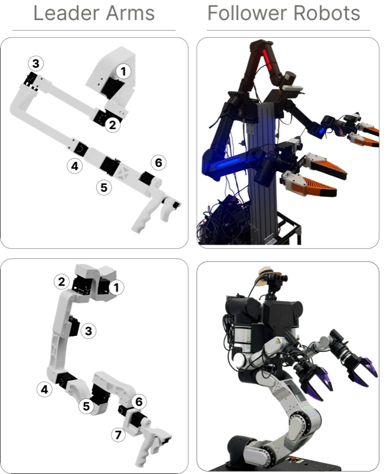

# Arm Integration

{ width=360 .center }

## General Motor Setup

Before assembling either arm variant, each Dynamixel servo must be configured with a unique ID and the correct baud rate. This is done using the [Dynamixel Wizard 2.0](https://docs.robotis.com/docs/software/dynamixel_wizard_2_0/introduction/).

### Installing Dynamixel Wizard 2.0

Download and install Dynamixel Wizard 2.0 from the [ROBOTIS website](https://docs.robotis.com/docs/software/dynamixel_wizard_2_0/introduction/). Connect your U2D2 interface board to your computer via USB. Note that all motors except the XL-330 require 12 V power through the power circuit while the XL-330 requires installation of the 5 V stepdown converter before being plugged in.

### Preparing the XL-330 (5V Stepdown)

The XL-330 servo operates at 5V, while the rest of the motor chain runs at 12V. A 5V stepdown converter must be installed on the link before the holder (for both leader arm variants) in the chain before connecting it to power.

1. Cut the end of the wire that will come out of the motor preceding the XL-330. Cut another Dynamixel connector in the same way, which will be used from the converter and signal line to the XL-330. You will need to cut through the signal line as well.
2. Use the [ENGINEER PA-09 crimper](../bom.md#engineer-pa09) to attach JST crimps from the [JST XH 2.54mm connector kit](../bom.md#jst-xh-kit) to the ground and power lines of the incoming motor \(V_{in}\). Slot them into the 2-pin female pin housing, connecting to VIN and GND on the converter.
3. Wire the stepdown converter inline. 12V in from the upstream motor ([XM430-W350](https://docs.robotis.com/docs/dxl/model_reference/x_series/xm_series/xm430-w350) for ARX5, [XM430-W210](https://docs.robotis.com/docs/dxl/model_reference/x_series/xm_series/xm430-w210) for RB-Y1m), 5V out to the XL-330 power pin. Refer to the [XL-330 e-manual](https://docs.robotis.com/docs/dxl/model_reference/x_series/xl_series/xl330-m288) for pinout details. Connect the signal line to one end of a [WAGO connector](../bom.md#wago).
4. Use the [pre-crimped cables](../bom.md#jst-wire-kit) with the 2-pin housing to connect to \(V_{out}\) and GND on the converter. On the other end of the cable, connect another 2-pin housing.
5. Using the second Dynamixel connector that has the header cut off, use the [ENGINEER PA-09 crimper](../bom.md#engineer-pa09) to attach JST crimps from the [JST XH 2.54mm connector kit](../bom.md#jst-xh-kit) to the ground and power lines of what will become the line to the XL-330 motor. Attach a 2-pin male header to the ground and power lines, connecting this to the female 2-pin out from the converter \(V_{out}\) and GND. Connect the remaining signal line to the other end of the [WAGO connector](../bom.md#wago).
6. Mount the board on the last link before the holder (applies to either arm) with [M2x6 screws](../bom.md#m2x6-screw) and the [M2 heat-set inserts](../bom.md#m2-heat-set).

  
 Top view

  
 Bottom view

   Wiring

### Setting Motor IDs

Motors must be assigned unique IDs so the arm controller can address each joint individually. It is easiest to configure one motor at a time.

1. Open Dynamixel Wizard 2.0 and click **Scan** to detect the connected motor.
2. Select the motor from the device list.
3. In the control table, find the **ID** field and set it to the desired joint number. Refer to the arm-specific section below for the correct ID assignment per joint.
4. Click **Save** to write the value to the motor.
5. Disconnect the motor and repeat for the next one.

### Setting Baud Rate

All motors must be set to the same baud rate used by the arm controller.

1. With the motor connected and detected, find the **Baud Rate** field in the control table.
2. Set the baud rate to **1000000 (1 Mbps)**.
3. Click **Save**.

### Attaching Servo Horns

Before inserting motors into 3D-printed links, attach the servo horn to the motor output shaft.

1. Align the servo horn with the spline on the output shaft. The horn is keyed so it will only fit in one orientation, so do not force it.
2. Press the horn firmly onto the shaft until it is fully seated.
3. Secure with the included horn screw.

---

## 3D Prints

### ARX5 Leader Arm (6-DoF)

  
Right Shoulder<a href="../../files/arx5/right-shoulder.step" download>STEP</a>

  
Left Shoulder<a href="../../files/arx5/left-shoulder.step" download>STEP</a>

  
Link 1<a href="../../files/arx5/link1.step" download>STEP</a>

  
Link 2<a href="../../files/arx5/link2.step" download>STEP</a>

  
Link 3<a href="../../files/arx5/link3.step" download>STEP</a>

  
Link 4<a href="../../files/arx5/link4.step" download>STEP</a>

  
Link 5<a href="../../files/arx5/link5.step" download>STEP</a>

  
Gripper (×2)<a href="../../files/arx5/right-gripper.step" download>STEP (R)</a><a href="../../files/arx5/left-gripper.step" download>STEP (L)</a>

  
Trigger (×2)<a href="../../files/shared/trigger-right.step" download>STEP (R)</a><a href="../../files/shared/trigger-left.step" download>STEP (L)</a>

### Motor Assembly and Setup (ARX5)

  

    
Shoulder <small>(left + right versions)</small>

    
  

  

    
Link 1

    
  

  

    
Link 2

    
  

  

    
Link 3

    
  

  

    
Link 4

    
  

  

    
Link 5

    
  

  

    
Holder <small>(left + right versions)</small>

    
  

  

    <button class="slide-prev">&#8592;</button>
    
    <button class="slide-next">&#8594;</button>
  

### Full Arm Assembly (ARX5)

<canvas class="model-viewer" data-model="/models/arms/arx_arm.glb" style="width:100%;max-width:500px;height:400px;border-radius:8px;display:block;margin:0 auto;"></canvas>

With all links pre-loaded with motors, assemble the arm starting from the shoulder and working outward to the holder. Use M2.5x4 screws included with each motor and hinge for all the hinge connections. For the holder connections, use [M2x6 screws](../bom.md#m2x6-screw). Refer to the 3D model above for screw placement. Left arm is mirrored for motor direction.

!!! note "Note"
    We provide assembly instructions for the default URDF and joint signs used in the paper and repo. Changes in motor assembly require updates in their respective files and re-export. 

---

### RB-Y1m Leader Arm (7-DoF)

  
Right Shoulder<a href="../../files/rby1m/right-shoulder.step" download>STEP</a>

  
Left Shoulder<a href="../../files/rby1m/left-shoulder.step" download>STEP</a>

  
Link 1<a href="../../files/rby1m/link1.step" download>STEP</a>

  
Link 2<a href="../../files/rby1m/link2.step" download>STEP</a>

  
Link 3<a href="../../files/rby1m/link3.step" download>STEP</a>

  
Link 4<a href="../../files/rby1m/link4.step" download>STEP</a>

  
Link 5<a href="../../files/rby1m/link5.step" download>STEP</a>

  
Link 6<a href="../../files/rby1m/link6.step" download>STEP</a>

  
Gripper (×2)<a href="../../files/rby1m/right-gripper.step" download>STEP (R)</a><a href="../../files/rby1m/left-gripper.step" download>STEP (L)</a>

  
Trigger (×2)<a href="../../files/shared/trigger-right.step" download>STEP (R)</a><a href="../../files/shared/trigger-left.step" download>STEP (L)</a>

### Motor Assembly and Setup (RB-Y1m)

  

    
Shoulder <small>(left + right versions)</small>

    
  

  

    
Link 1

    
  

  

    
Link 2

    
  

  

    
Link 3

    
  

  

    
Link 4

    
  

  

    
Link 5

    
  

  

    
Link 6

    
  

  

    
Holder <small>(left + right versions)</small>

    
  

  

    <button class="slide-prev">&#8592;</button>
    
    <button class="slide-next">&#8594;</button>
  

### Full Arm Assembly (RB-Y1m)

<canvas class="model-viewer" data-model="/models/arms/rby1m_arm.glb" data-cam-x="-0.3" data-cam-y="0.8" data-cam-z="1.4" style="width:100%;max-width:500px;height:400px;border-radius:8px;display:block;margin:0 auto;"></canvas>

With all links pre-loaded with motors, assemble the arm starting from the shoulder and working outward to the holder. Use M2.5x4 screws included with each motor and hinge for all the hinge connections. For the holder connections, use M2x3 screws from the [FR-12 Bracket Kit](../bom.md#fr12-bracket-kit). Refer to the 3D model above for screw placement. Left arm is mirrored for motor direction.

!!! note "Note"
    We provide assembly instructions for the default URDF and joint signs used in the paper and repo. Changes in motor assembly require updates in their respective files and re-export. 

