# Backpack Build

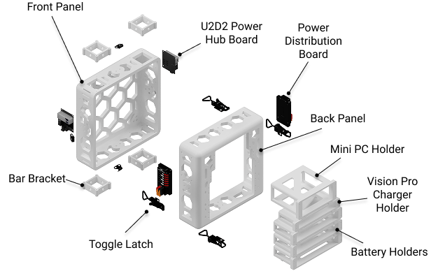{ .center }

In this section, we will walk through all of the necessary steps to fabricate and assemble the ModPack core.

!!! warning "Before You Begin"
    The [U2D2](../bom.md#u2d2) must be assembled onto the [U2D2 Power Hub Board](../bom.md#u2d2-power-hub) before installing it in the backpack.

## Tools Required

!!! note ""
    - Soldering iron with heat-set insert tip
    - Hex wrench set (2.5 mm, 3 mm, 5 mm)
    - Small crescent wrench

## 3D Prints

!!! note "Tool Required"
    FDM 3D printer (Bambu Labs H2D or X1 Carbon recommended)

All backpack components were printed on a Bambu Labs H2D (large panels) or Bambu X1 Carbon (smaller pieces). The backpack is split into two halves so each half fits on a standard print bed.

| Parameter | Value |
|-----------|-------|
| Material | PLA |
| Infill | 15% |
| Infill Pattern | Gyroid |
| Layer Height | 0.2 mm |
| Wall Count | 2 |
| Nozzle Diameter | 0.4 mm |
| Support Strategy | Tree |

  
Front Panel<a href="../../files/backpack/front-panel.step" download>STEP</a>

  
Back Panel<a href="../../files/backpack/back-panel.step" download>STEP</a>

  
Bar Bracket (×4)<a href="../../files/backpack/bar-bracket.step" download>STEP</a>

  
PC Holder<a href="../../files/backpack/pc-holder.step" download>STEP</a>

  
Vision Pro Charger Holder<a href="../../files/backpack/vp-charger-holder.step" download>STEP</a>

  
Top Battery Shelf<a href="../../files/backpack/shelf-top.step" download>STEP</a>

  
Middle Battery Shelf<a href="../../files/backpack/shelf-mid.step" download>STEP</a>

  
Bottom Battery Shelf<a href="../../files/backpack/shelf-bottom.step" download>STEP</a>

  
Toggle Latch (×10)<a href="../../files/backpack/toggle-latch.step" download>STEP</a>

## Heat Set Inserts
After printing, we install heat set inserts to provide rigid mounting points for bolts. We find a good temperature for the soldering iron is 220 C.

!!! note "Tool Required"
    Soldering iron, optionally with a heat-set insert tip.

<figure markdown>
  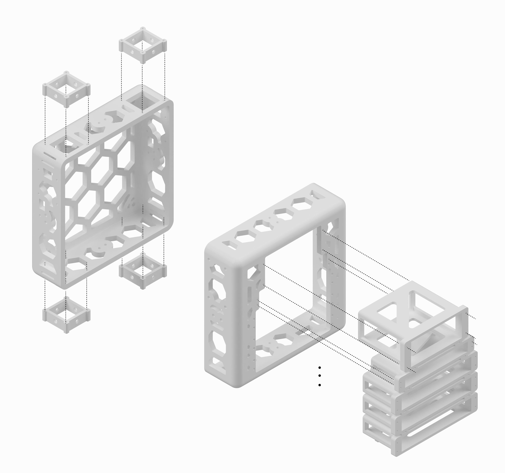{ .center width=600 }
  <figcaption>Heat set insert locations on the backpack panels.</figcaption>
</figure>

Use the above diagram to find the heat set insert locations. Use the [94180A321 M2.5x3.4 heat-set inserts](../bom.md#94180A321).

## Brackets
Once heat sets are in, use the [97763A822 M5x16 button head screws](../bom.md#97763A822) to fasten the 3D printed brackets.

## Latches
<figure markdown>
  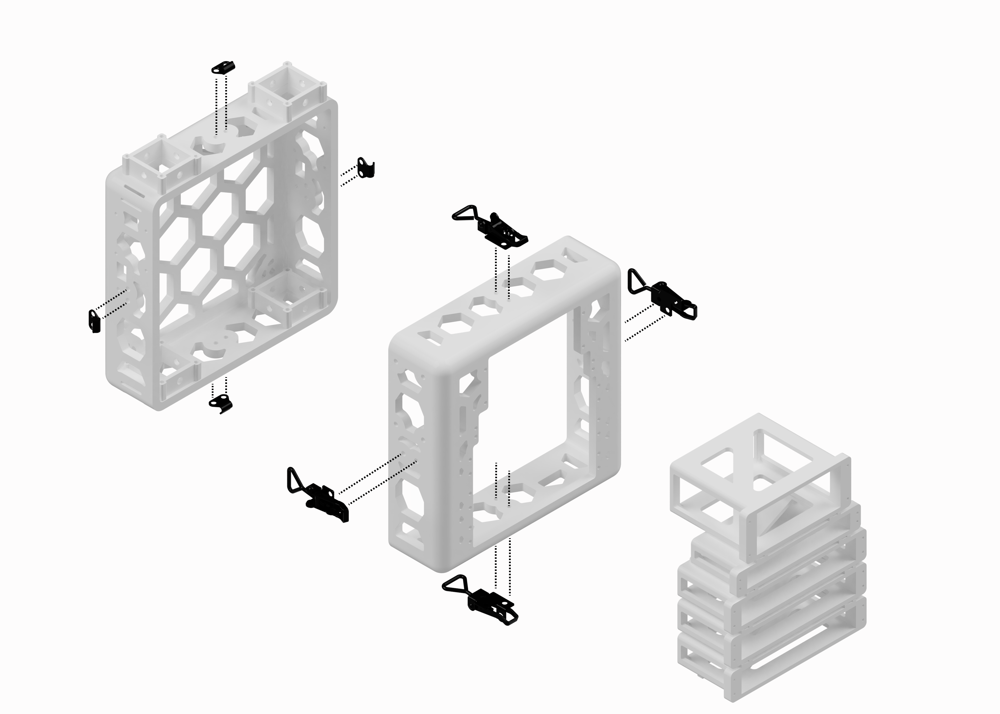{ .center width=600 }
  <figcaption>Latch mounting hole locations.</figcaption>
</figure>

Next, install the [latches](../bom.md#latch) using [97763A822 M5x16 button head screws](../bom.md#97763A822) and [93625A200 M5 nylon lock nuts](../bom.md#93625A200).

## Mounting Arm Bars

<figure markdown>
  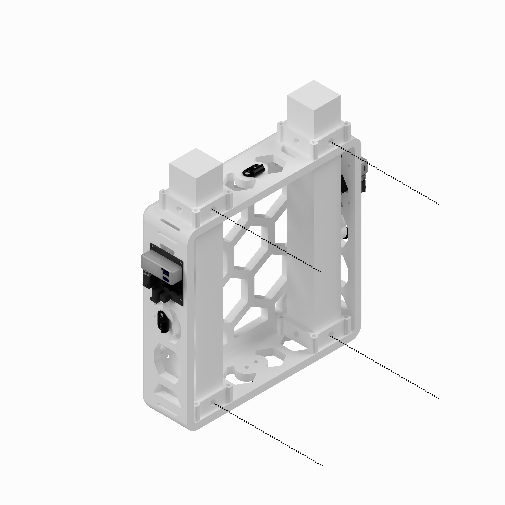{ .center width=600 }
  <figcaption>The two vertical 40x40 bars are the mounting points for the leader arms. The dotted lines indicate where to secure the bars using the sliding nuts and M5 bolts described in the callout below.</figcaption>
</figure>

!!! note "Mounting the arm bars"
    The leader arms mount to two vertical [40×40 T-slot extrusion](../bom.md#40x40-extrusion) bars that slot into the top of the front panel of the backpack. Once you have installed the [bar brackets](#3d-prints) (x4) with the [91292A832 M2x8 socket head screws](../bom.md#91292A832), slide the 40x40 bars into place, securing them by following the dotted callouts with [97763A822 M5x16 button head screws](../bom.md#97763A822) and the [T-slot sliding T-nuts](../bom.md#t-slot-sliding-nuts).

## Mounting Electronics

<figure markdown>
  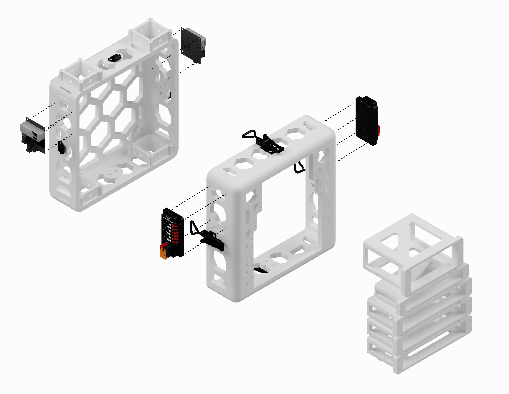{ .center width=600 }
  <figcaption>Mounting points for electronics.</figcaption>
</figure>

### U2D2 Power Hub and REV Mini PDP

<figure markdown>
  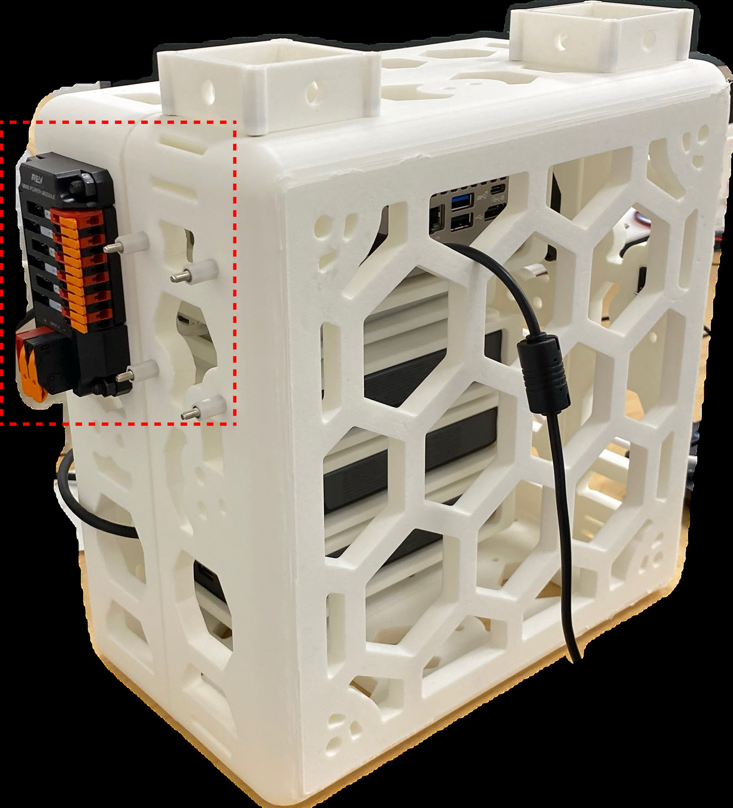{ .center width=300 }
  <figcaption>Note the direction of the bolts for the REV as well as for the U2D2 offsets.</figcaption>
</figure>

Use the provided screw offsets, securing the back of the U2D2 board with the [91292A016 M2.5x12 socket head screws](../bom.md#91292A016) and [93475A210 M2.5 washers](../bom.md#93475A210).

With the bolt head ([91290A252 M5x25 socket head screw](../bom.md#91290A252)) on the inside of the backpack, mount the [REV Mini Power Module](../bom.md#rev-mini-pdp) to the side of the backpack, securing with a [93625A200 M5 nylon lock nut](../bom.md#93625A200).

## Shelves

<figure markdown>
  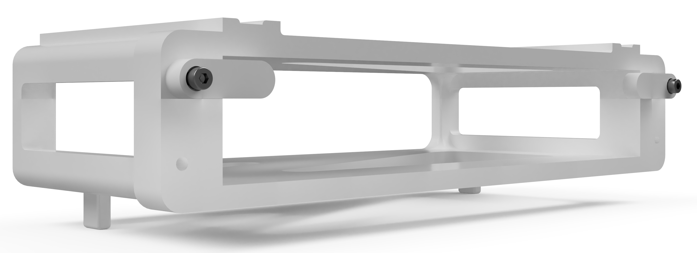{ .center width=400 }
  <figcaption>Bottom shelf with two latches. Note that you can only install one on each side, though mounting points are provided for two on each side. It is up to you what configuration you want.</figcaption>
</figure>

Install the shelves in bottom-up order, as the bottom shelf has a set of stands that cannot be fit in the backpack if the shelf above is installed. Pictured above is the bottom-most shelf along with the attached latches that hold the components in. Tighten such that you can still move the latches to slide components in and out.

## iPhone Mount
Attach the iPhone mount with zipties by looping the ties through the backpack, as shown below. 
<figure markdown>
  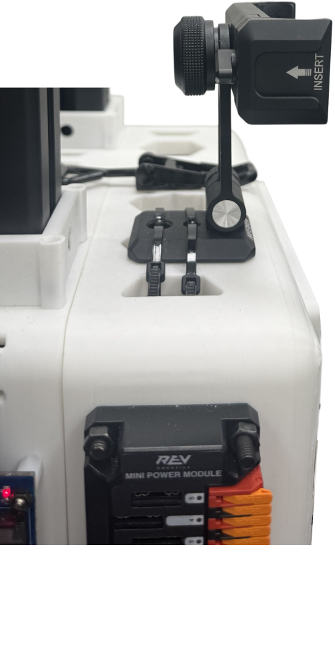{ .center width=200 }
  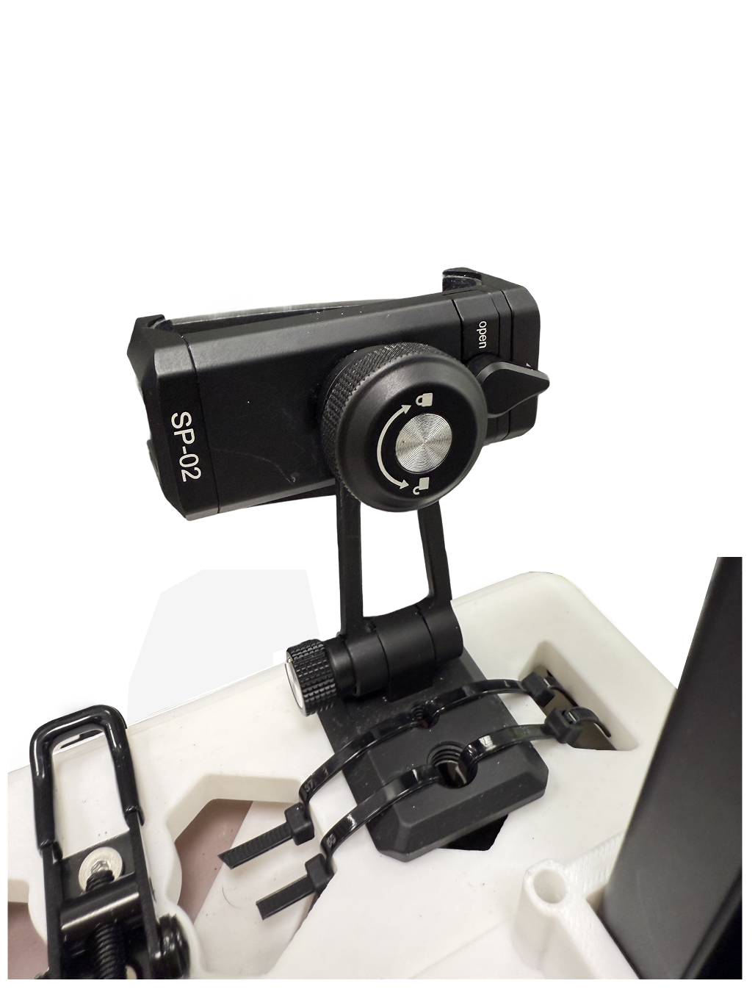{ .center width=200 }
  <figcaption>Side view and top view</figcaption>
</figure>

## Backpack Straps
Upper straps: 
Loop a strap through the backpack, then assemble using the multi-purpose buckle set so that the buckle faces outwards. 
<figure markdown>
  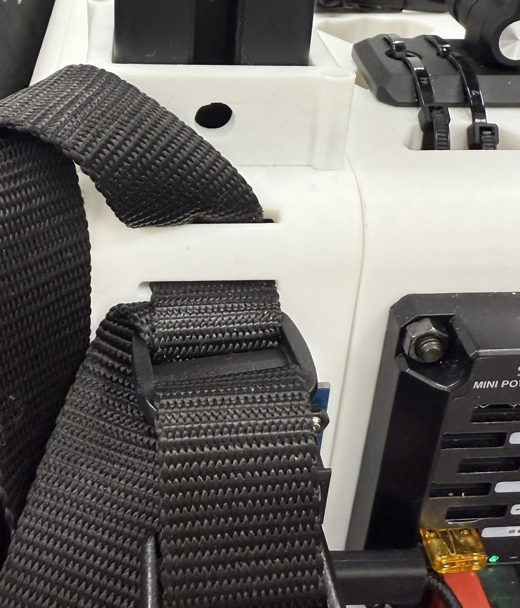{ .center width=200 }
</figure>
<figure markdown>
  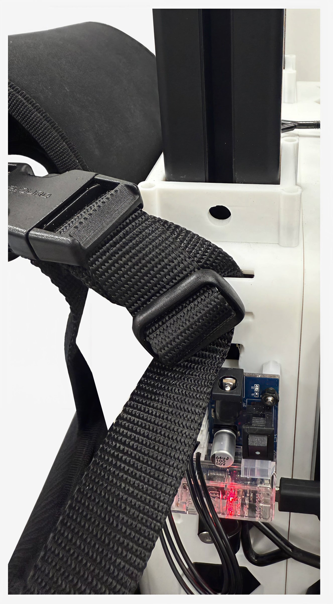{ .center width=200 }
</figure>
For buckle assembly, see specific manufacturer instructions <a href="https://m.media-amazon.com/images/I/B1ZCNi1e-nL.pdf" style="color: blue;">here</a>.

Lower straps: 
Loop the harness strap directly through the backpack hole as shown below. More detailed installation steps can be found on the [manufacturer's page](https://www.amazon.com/dp/B0DHL1KNZ7). Adjust tightness as needed. 
<figure markdown>
  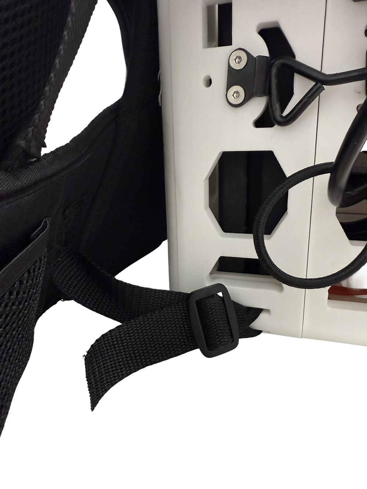{ .center width=200 }
</figure>

