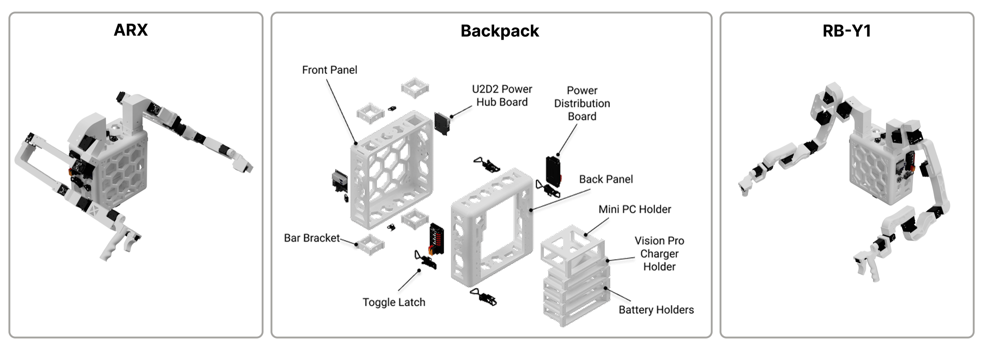

# Assembly Overview

ModPack consists of a core "backpack" interface that the rest of the modules such as the leader arms attach to. Pictured above are the two leader arm configurations currently supported by ModPack, as well as an exploded view of the backpack itself.

---

## What You'll Build

- [**Backpack**](backpack.md): Walks through 3D printing up to attaching mounted components and wiring the power circuit.
- [**Arms**](arms.md): Details fabrication of both ARX and RB-Y1m leaders arms as well as integration into the backpack.

---

!!! tip
    It is highly recommended that you start with the backpack, as testing the arms requires the power circuit.
