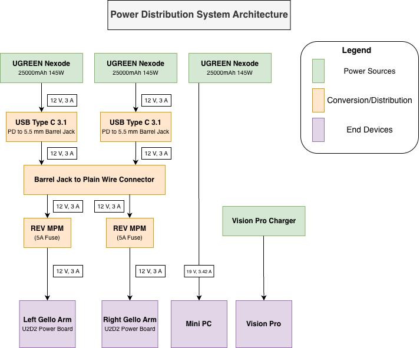
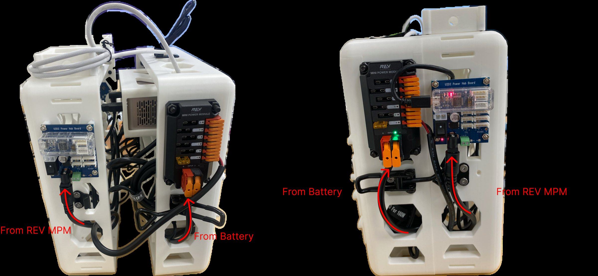

# Wiring

{ .center }

!!! note "Cable Management"
    To reduce the amount of wire outside of the backpack, we recommend that excess wiring is routed through the backpack slots.

## Overview
There are three power banks that serve the backpack, one for each leader arm (if attached) and one for the mini PC. This section will walk through how to wire the associated power circuit, starting with preparing leader arm power and moving to the Mini PC. Note that the Vision Pro connects to its dedicated charger and is not part of the circuit.

<figure markdown>
  { .center width=600 }
</figure>

## Power Banks → REV Mini Power Modules → U2D2 Power Hub Boards
Attach the USBC end of the [PD Trigger Cable](../bom.md#pd-trigger-cable) to OUT1 of the [UGREEN 145W Power Banks](../bom.md#ugreen-145w). Next, insert the other end of the PD trigger cable to the [Female DC Barrel Jack](../bom.md#dc-barrel-female).

Next, split the remaining end of the pigtail barrel jack and lift up on the largest tabs on the [REV MPM](../bom.md#rev-mini-pdp), inserting red wire into the red slot and black wire into the associated slot.

Before attaching the output cable to the REV MPM, first insert the 5 A fuse that comes with the kit into the slot you plan to use for the arms (you can choose any). Split the free end of the [Male DC Barrel Jack](../bom.md#dc-barrel-male), lifting the tabs of the associated channel where the fuse is and insert red to red, black to black. The [U2D2 Power Hub Board](../bom.md#u2d2-power-hub) will be what connects the leader arms to power and communication.

## Mini PC Power
The remaining [UGREEN 145W Power Bank](../bom.md#ugreen-145w) uses the [PC Cable](../bom.md#pc-cable) to directly connect to the [Mini PC](../bom.md#geekom-a5). Again, use OUT1 for the USB C cable.