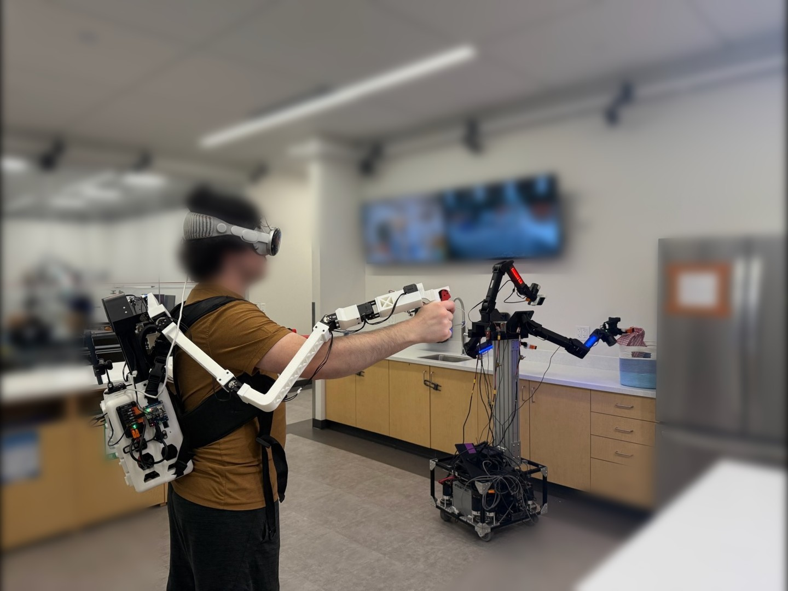

# ModPack

{ .center width=700 }

## Where to Start
These docs contain hardware build instructions as well as a high-level overview of the software layout. For details on running the software for teleoperation, see [the software repository](https://github.com/modpackteleoperation/modpack).

  <a class="nav-card" href="bom/">
    Bill of Materials
    Parts list with pricing and vendor links.
  </a>
  <a class="nav-card" href="assembly/">
    Assembly
    Build the backpack and leader arms.
  </a>
  <a class="nav-card" href="software/">
    Software
    Install and configure the ModPack software stack.
  </a>

