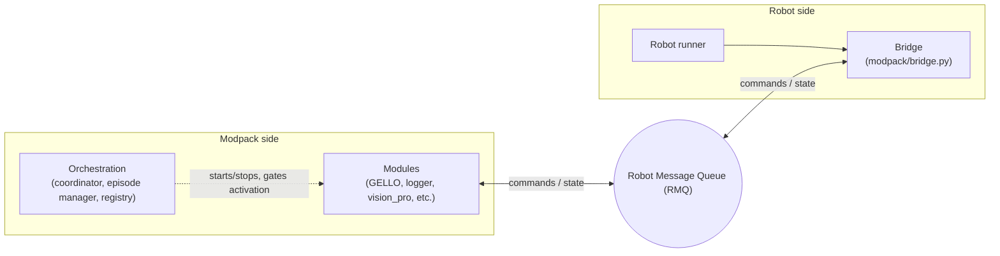

# Software Overview

ModPack software is built around three parts:

1. **Bridge** — SDK library that robot controllers import to receive commands and publish state
2. **Modules** — self-contained modpack-side processes (GELLO leader arms, logger, Vision Pro, base)
3. **Orchestration** — lifecycle engine that starts/stops modules and manages episodes



The two sides communicate only through the RMQ bus, and topology is set per-robot in `config.yaml`.

!!! note "Reference"
    The repository map, CLI flags, config schema, and control-key tables live in the code repo:
    [README]({{ repo_blob }}/README.md) ·
    [robots/README]({{ repo_blob }}/modpack/robots/README.md) ·
    [orchestration/README]({{ repo_blob }}/modpack/orchestration/README.md)

- [Configuration](configuration.md) — How to setup within ModPack repo
- [Modules](modules.md) — Vision Pro head tracking and iPhone base control

## Installation

### ModPack Mini PC

Follow the [TidyBot2 software setup guide](https://tidybot2.github.io/docs/software/) and navigate to **Mini PC Setup** to configure the Mini PC, including OS installation and SSH.

!!! note "Performance tuning"
    On the ModPack PC, limit the CPU frequency, per the CPU-frequency step in the [ModPack README]({{ repo_blob }}/README.md), so the logging load does not lag control.

#### Network Setup

The Mini PC and the robot PC must be on the same network. For best performance, connect the robot to a dedicated WiFi network rather than a shared one.

### ModPack Software

Clone [the repo](https://github.com/modpackteleoperation/modpack) and create the conda environment:

```bash
conda env create -f environment.yaml
conda activate modpack
```

### Robot-specific setup

Each robot needs additional setup not covered above (for example building `arx5_interface` or the `rby1-sdk`), documented in its README:
[arx5/README]({{ repo_blob }}/modpack/robots/arx5/README.md) ·
[rby1/README]({{ repo_blob }}/modpack/robots/rby1/README.md)

## Entry Point

The main entry point(s) for launching teleoperation with ModPack are the following commands.
```bash
# For ARX robot
python -m modpack --gello --robot arx5

# For RB-Y1m
python -m modpack --gello --robot rby1
```

### Topology
There are two ways to structure the connection between the ModPack PC and the robot PC. The mode is set per-robot via `topology` in `config.yaml` — see [robots/README]({{ repo_blob }}/modpack/robots/README.md).

**Managed topology** — The ModPack PC manages everything: it launches the robot PC's teleop on startup and kills it on shutdown.

- You → ModPack PC → activates Robot PC teleop
- On shutoff: ModPack kills Robot PC teleop automatically

#### Example: ARX5
Launching the `modpack` command handles the lifecycle of both the ModPack PC and the robot PC automatically. To enable this, you must set up passwordless SSH from the ModPack PC to the robot PC. 
```bash
ssh-keygen -t ed25519

# Fill in with your user and hostname for robot PC
ssh-copy-id user@hostname
```

**Unmanaged topology** — You manage both PCs independently.

- You → ModPack PC (separately) and You → Robot PC teleop (separately)
- On shutoff: stop the robot command/teleop loop first, then stop the ModPack (recommended for safety)

#### Example: RB-Y1m
For RB-Y1m, the order of operations is to first run the above `modpack` python command, activate relevant subsystems as will be discussed, and then run command below.
```bash
# For RB-Y1m
python modpack/robots/rby1/scripts/rby1_wbc_teleop_gello.py
```

### CLI Flags

!!! note "Reference"
    The full CLI flag list (`--gello`, `--robot`, `--vp-stream-mode`, `--vp-bypass-neck`, `--modules`, …) lives in the [README]({{ repo_blob }}/README.md).

### Episode and Activation Controls
The keys *s*, *v*, and *q* control episode logging, module activation, and shutdown once the `modpack` command is launched.

#### Episode Control (*s* key)

!!! note "Reference"
    The tap-pattern table (start/stop/pause/resume/delete) lives in the [README]({{ repo_blob }}/README.md).

#### Module Activations (*v* key)
The specific number of taps of the *v* key required to activate each module (such as leader arms, vision pro, etc) is contained within the `activation_buttons` section of each robot's `config.yaml`, where the number next to each module name is the number of quick, consecutive taps required to activate.

#### Shutdown (*q* key)
Pressing *q* at any point after launching the `modpack` command will shutdown ModPack code. 
!!! warning
    **The code is not responsive to ctrl+c.**
