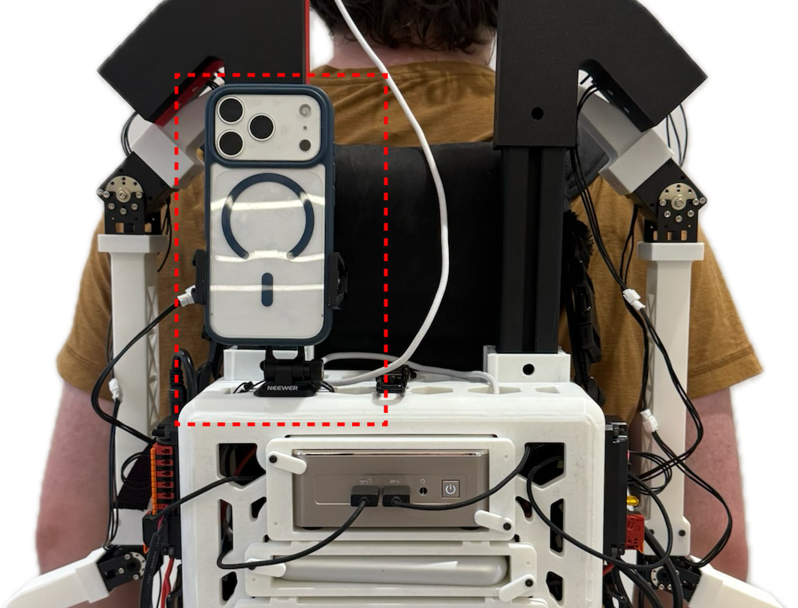

# Modules

## Vision Pro

To use the Vision Pro, you will first need to install the Vision Pro app and connect to the same network as the ModPack PC as well as robot PC if applicable. After cloning the [repo](https://github.com/modpackteleoperation/poseStreamer), refer to how to upload to the vision pro [here](https://developer.apple.com/documentation/xcode/running-your-app-on-simulated-or-physical-devices). When ready to use, open the app and click the gear icon in the upper right corner of the app. From here, enter the ip of the computer used to launch the Vision Pro process.

!!! note "Reference"
    Module internals, activation flow, and `VP_BYPASS_NECK`: [vision_pro/README]({{ repo_blob }}/modpack/modules/vision_pro/README.md).

!!! note
    You need Xcode to build the Vision Pro app, so the build machine must be a Mac.

### Neck Configuration (ARX Robot Only)

If using the ARX5-based mobile robot described in [Vision-in-Action](https://vision-in-action.github.io/), the specific CAN interface, control frequency, and iPhone camera configuration used are defined in `neck_config.yaml` within the arx5 robot folder. Refer to the Vision-in-Action hardware documentation for how to set up the CAN interface, and to its point-cloud streaming instructions for how to set up RGB/PCD streaming on the neck iPhone.

### Using the App

When you open the app, you will see a screen that can be moved. Move the window up and above your head such that it is out of view, as the actual display will show up in front of you. When using the app to control the neck, be sure to be still and face forward until you see that the robot neck has started to move.

## Base Control with iPhone

To use the iPhone for base control, you must first download a compatible browser. From the advice of the [tidybot++ documentation](https://tidybot2.github.io/docs/usage/) we use [XR Browser](https://apps.apple.com/us/app/xr-browser/id1588029989), which can be found in the app store. Next, you must connect your phone to the same network as the ModPack PC as well as robot PC if applicable. Next, navigate to the ip address of the hosting computer (either ModPack or robot PC depending on layout) on port 5000. You will then want to mount the iPhone on the phone mount with the screen facing towards the operator's back as shown below.

<figure markdown>
  { .center width=400 }
  <figcaption>iPhone mounted with screen facing towards the operator's back.</figcaption>
</figure>

When using a robot that is not the tidybot base that controls its own base separately (such as the RB-Y1m), use the `use_mock_base` flag (under `module_overrides.base`) in the robot `config.yaml`. To activate the base, tap the appropriate activation keys as explained in [Configuration](configuration.md). Currently, the base will only move once the *s* key is tapped, indicating the start of an episode.

!!! note "Reference"
    Base module internals (RMQ topics, `use_mock_base`): [base/README]({{ repo_blob }}/modpack/modules/base/README.md).